# Template Index

Complete inventory of all 27 governance templates + 4 generators with descriptions, dependencies, quickstart profiles, and dependency graph.

> **v2.1:** Added CLAUDE_MD template, `project.yaml` config schema, and 3 code generators (G1, G5, G6) + master runner.
> **v2.0:** All templates have version metadata, authority hierarchy headers, companion contract
> cross-references, verification annotations on MUST requirements, and enforcement mechanisms.

---

## Core Contracts (`templates/core/`)

| # | Template | File | Depends On | When to Use |
|---|----------|------|------------|-------------|
| 1 | **Data Contract** | `DATA_CONTRACT.tmpl.md` | — | You have datasets with train/val/test splits and need leakage prevention |
| 2 | **Environment Contract** | `ENVIRONMENT_CONTRACT.tmpl.md` | — | You need reproducible experiments on a specified platform |
| 3 | **Experiment Contract** | `EXPERIMENT_CONTRACT.tmpl.md` | Data, Environment, Metrics | You're running structured experiments with budgets and comparisons |
| 4 | **Metrics Contract** | `METRICS_CONTRACT.tmpl.md` | Data | You need locked metric definitions, thresholds, and sanity checks |
| 5 | **Figures & Tables Contract** | `FIGURES_TABLES_CONTRACT.tmpl.md` | Experiment, Metrics | You're generating report-ready figures and tables |
| 6 | **Artifact Manifest Spec** | `ARTIFACT_MANIFEST_SPEC.tmpl.md` | Experiment | You want SHA-256 integrity verification of all outputs |
| 7 | **Script Entrypoints Spec** | `SCRIPT_ENTRYPOINTS_SPEC.tmpl.md` | All core contracts | You have multiple scripts with CLI flags and need a stable interface |
| 8 | **Hypothesis Contract** | `HYPOTHESIS_CONTRACT.tmpl.md` | Data, Metrics | You need pre-registered hypotheses with temporal gating before experiments |
| 9 | **AI Division of Labor** | `AI_DIVISION_OF_LABOR.tmpl.md` | Experiment, Data | You're using AI tools and need human-AI collaboration boundaries |
| 10 | **Configuration Spec** | `CONFIGURATION_SPEC.tmpl.md` | Experiment, Metrics, Data | You have layered config files and need config-as-code governance |
| 11 | **Test Architecture** | `TEST_ARCHITECTURE.tmpl.md` | Data, Experiment, Metrics, Configuration | You need structured testing with leakage, determinism, and sanity categories |
| 12 | **Adversarial Evaluation** | `ADVERSARIAL_EVALUATION.tmpl.md` | Experiment, Metrics, Data | *(Optional)* You need adversarial robustness evaluation with threat models |
| 13 | **Environment Spec (RL)** | `ENVIRONMENT_SPEC.tmpl.md` | Environment Contract | *(Optional)* You have RL/simulation environments requiring MDP specification |

**Recommended setup order:** Environment → Data → Metrics → Hypothesis → Experiment → Configuration → Scripts → Figures/Tables → Artifacts → Test Architecture → AI Division of Labor → *(optional: Adversarial, RL Environment)*

---

## Management Templates (`templates/management/`)

| # | Template | File | Depends On | When to Use |
|---|----------|------|------------|-------------|
| 14 | **Implementation Playbook** | `IMPLEMENTATION_PLAYBOOK.tmpl.md` | All core contracts | Multi-phase project; need phase gates and iteration discipline |
| 15 | **Task Board** | `TASK_BOARD.tmpl.md` | Playbook | Need task tracking with dependencies and critical path |
| 16 | **Risk Register** | `RISK_REGISTER.tmpl.md` | All core contracts | Project has acceptance criteria or compliance requirements |
| 17 | **Decision Log** | `DECISION_LOG.tmpl.md` | — | Making architectural decisions that need to be recorded |
| 18 | **Changelog** | `CHANGELOG.tmpl.md` | Decision Log | Tracking CONTRACT_CHANGE commits |
| 19 | **Prior Work Reuse** | `PRIOR_WORK_REUSE.tmpl.md` | Data, Environment | Reusing code/data/models from a prior project |
| 27 | **Claude Code Context** | `CLAUDE_MD.tmpl.md` | All core contracts, Phases | You want governed AI collaboration with phase awareness and authority hierarchy |

---

## Report & Delivery Templates (`templates/report/`)

| # | Template | File | Depends On | When to Use |
|---|----------|------|------------|-------------|
| 20 | **Report Assembly Plan** | `REPORT_ASSEMBLY_PLAN.tmpl.md` | Figures/Tables, Metrics | Writing a structured technical report with figures and hypotheses |
| 21 | **Reproducibility Spec** | `REPRODUCIBILITY_SPEC.tmpl.md` | Environment, Data, Scripts, Artifacts | You need a single document enabling end-to-end reproduction |
| 22 | **Pre-Delivery Checklist** | `PRE_SUBMISSION_CHECKLIST.tmpl.md` | All | Final delivery audit (attribution, compliance, reproducibility, artifacts) |
| 23 | **Execution Manifest** | `EXECUTION_MANIFEST.tmpl.md` | Experiment, Metrics, Artifacts, Figures/Tables | Auto-generated methods summary + results index; report numbers trace here |
| ref | **IEEE Report Template** | `IEEE_Report_Template.tex` | — | Need a LaTeX starting point for IEEE-format papers |

---

## Publishing Templates (`templates/publishing/`)

| # | Template | File | Depends On | When to Use |
|---|----------|------|------------|-------------|
| 24 | **Publication Brief** | `PUBLICATION_BRIEF.tmpl.md` | Report Assembly, Hypothesis | You need message governance: target reader, anti-claims, portfolio alignment |
| 25 | **Academic Integrity Firewall** | `ACADEMIC_INTEGRITY_FIREWALL.tmpl.md` | AI Division of Labor, Prior Work Reuse | You need explicit data/code/content reuse boundaries and verification |
| 26 | **Lean Hypothesis** | `LEAN_HYPOTHESIS.tmpl.md` | Hypothesis Contract, Publication Brief | You need strategic hypothesis framing with kill criteria and validation plans |

---

## Executable Scaffolding (`scripts/generators/`)

| # | Generator | Input (project.yaml) | Output | Purpose |
|---|-----------|---------------------|--------|---------|
| G1 | `gen_sweep.py` | `experiments` | `scripts/sweep.sh` | Experiment orchestration with nested method × dataset × seed loops |
| G5 | `gen_manifest_verifier.py` | `artifacts` | `scripts/verify_manifests.py` | SHA-256 artifact integrity verification |
| G6 | `gen_phase_gates.py` | `phases` | `scripts/check_phase_*.sh` | Phase gate check scripts + all-gates runner |
| — | `generate_all.py` | All sections | All of the above | Master runner that invokes G1, G5, G6 in sequence |
| — | `orchestrate.py` | All sections | All of the above | Agent orchestrator — Claude Agent SDK (agent mode), standalone, dry-run |

**Config file:** `project.yaml` (see `project.yaml.example` for full schema)

```bash
# Agent mode — Claude Agent SDK reads project.yaml, reasons about what to generate
python scripts/generators/orchestrate.py project.yaml

# Standalone mode — deterministic, no LLM calls (works in CI)
python scripts/generators/orchestrate.py project.yaml --standalone

# Dry run — show what would be generated
python scripts/generators/orchestrate.py project.yaml --dry-run

# Simple mode — run all generators directly (no agent reasoning)
python scripts/generators/generate_all.py project.yaml --output-dir .

# Or run individually
python scripts/generators/gen_sweep.py project.yaml --output scripts/sweep.sh
python scripts/generators/gen_phase_gates.py project.yaml --output-dir scripts/
python scripts/generators/gen_manifest_verifier.py project.yaml --output scripts/verify_manifests.py
```

---

## Prompt Playbook

| # | Document | File | Purpose |
|---|----------|------|---------|
| — | **Prompt Playbook** | `PROMPT_PLAYBOOK.md` | AI-assisted workflow: initial setup (1-5), source verification (6), governance audits (7-8), test generation (9), plus specialized stages (1b, 4b-4g) |

---

## Quickstart Profiles

Choose a profile based on your project type. Each profile lists the templates to include and which optional appendices to activate.

### Minimal (3 templates)

**Use for:** Quick experiments, prototypes, single-part studies with no formal delivery requirements.

| Template | Optional Appendices |
|----------|-------------------|
| ENVIRONMENT_CONTRACT | — |
| DATA_CONTRACT | — |
| METRICS_CONTRACT | — |

```bash
bash scripts/init_project.sh /path/to/project --profile minimal
```

---

### Supervised ML (9 templates)

**Use for:** Classification/regression projects with train/val/test splits, formal report, and reproducibility requirements.

| Template | Optional Appendices |
|----------|-------------------|
| ENVIRONMENT_CONTRACT | — |
| DATA_CONTRACT | Activate §3.5 (prior-project split inheritance) if reusing splits |
| METRICS_CONTRACT | Activate Appendix B (unsupervised) only if also doing clustering |
| EXPERIMENT_CONTRACT | — |
| FIGURES_TABLES_CONTRACT | — |
| HYPOTHESIS_CONTRACT | — |
| REPORT_ASSEMBLY_PLAN | — |
| REPRODUCIBILITY_SPEC | — |
| PRE_SUBMISSION_CHECKLIST | — |

```bash
bash scripts/init_project.sh /path/to/project --profile supervised
```

---

### Optimization Benchmark (11 templates)

**Use for:** Comparing optimizers, hyperparameter studies, ablation studies with budget-matched comparisons and multi-seed stability.

| Template | Optional Appendices |
|----------|-------------------|
| ENVIRONMENT_CONTRACT | — |
| DATA_CONTRACT | Activate §3.5 if inheriting splits from prior project |
| METRICS_CONTRACT | Activate §5 (convergence threshold governance) |
| EXPERIMENT_CONTRACT | Activate pipeline composition protocol if multi-part |
| CONFIGURATION_SPEC | — |
| FIGURES_TABLES_CONTRACT | Activate §8 visualization catalog (convergence, sensitivity, stability) |
| ARTIFACT_MANIFEST_SPEC | — |
| SCRIPT_ENTRYPOINTS_SPEC | — |
| HYPOTHESIS_CONTRACT | — |
| IMPLEMENTATION_PLAYBOOK | — |
| RISK_REGISTER | — |

```bash
bash scripts/init_project.sh /path/to/project --profile optimization
```

---

### Unsupervised Analysis (21 templates)

**Use for:** Clustering, dimensionality reduction, density estimation projects.

| Template | Optional Appendices |
|----------|-------------------|
| ENVIRONMENT_CONTRACT | — |
| DATA_CONTRACT | — |
| METRICS_CONTRACT | Activate Appendix B (unsupervised evaluation menu) |
| EXPERIMENT_CONTRACT | — |
| FIGURES_TABLES_CONTRACT | Activate §8.5 (unsupervised figures: elbow, silhouette, cluster viz) |
| ARTIFACT_MANIFEST_SPEC | — |
| HYPOTHESIS_CONTRACT | — |
| AI_DIVISION_OF_LABOR | — |
| CONFIGURATION_SPEC | — |
| SCRIPT_ENTRYPOINTS_SPEC | — |
| TEST_ARCHITECTURE | — |
| IMPLEMENTATION_PLAYBOOK | — |
| PRIOR_WORK_REUSE | — |
| DECISION_LOG | — |
| CHANGELOG | — |
| RISK_REGISTER | — |
| TASK_BOARD | — |
| REPORT_ASSEMBLY_PLAN | — |
| REPRODUCIBILITY_SPEC | — |
| PRE_SUBMISSION_CHECKLIST | — |
| EXECUTION_MANIFEST | — |

```bash
bash scripts/init_project.sh /path/to/project --profile unsupervised
```

---

### RL / Agent Study (22 templates)

**Use for:** Reinforcement learning, sequential decision-making, simulation-based optimization — with full delivery, reproducibility, and integrity support.

| Template | Optional Appendices |
|----------|-------------------|
| ENVIRONMENT_CONTRACT | — |
| DATA_CONTRACT | — (may be minimal for RL) |
| METRICS_CONTRACT | Activate Appendix C (RL policy evaluation) |
| EXPERIMENT_CONTRACT | Activate Appendix A (sequential/RL protocol) |
| ENVIRONMENT_SPEC | **Full activation** (MDP definition, reward, dynamics) |
| FIGURES_TABLES_CONTRACT | Activate §8.5 (RL figures: learning curves, reward heatmaps) |
| ARTIFACT_MANIFEST_SPEC | — |
| SCRIPT_ENTRYPOINTS_SPEC | — |
| HYPOTHESIS_CONTRACT | — |
| AI_DIVISION_OF_LABOR | — |
| CONFIGURATION_SPEC | — |
| TEST_ARCHITECTURE | — |
| IMPLEMENTATION_PLAYBOOK | — |
| RISK_REGISTER | — |
| DECISION_LOG | — |
| CHANGELOG | — |
| PRIOR_WORK_REUSE | Only if reusing prior project artifacts |
| REPORT_ASSEMBLY_PLAN | — |
| REPRODUCIBILITY_SPEC | — |
| PRE_SUBMISSION_CHECKLIST | — |
| EXECUTION_MANIFEST | — |
| ACADEMIC_INTEGRITY_FIREWALL | — |

```bash
bash scripts/init_project.sh /path/to/project --profile rl-agent
```

---

### Full + Publishing (all 26 templates)

**Use for:** Complex multi-phase projects with prior work reuse, strict compliance, formal delivery, and publication/portfolio goals.

| Template | Optional Appendices |
|----------|-------------------|
| All 13 core templates | Activate appendices based on project type (supervised, unsupervised, RL, adversarial) |
| All 6 management templates | — |
| All 4 report templates | — |
| All 3 publishing templates | — |

```bash
bash scripts/init_project.sh /path/to/project --profile full
```

---

## Dependency Graph

```mermaid
graph TD
    %% Foundational (no dependencies)
    ENV[Environment Contract]
    DATA[Data Contract]

    %% Core layer 1
    METRICS[Metrics Contract] --> DATA
    HYPO[Hypothesis Contract] --> DATA
    HYPO --> METRICS

    %% Core layer 2
    EXP[Experiment Contract] --> DATA
    EXP --> ENV
    EXP --> METRICS
    CONFIG[Configuration Spec] --> EXP
    CONFIG --> METRICS
    CONFIG --> DATA

    %% Core layer 3
    FIG[Figures & Tables Contract] --> EXP
    FIG --> METRICS
    ART[Artifact Manifest Spec] --> EXP
    SCRIPT[Script Entrypoints Spec] --> EXP
    SCRIPT --> DATA
    SCRIPT --> ENV
    TEST[Test Architecture] --> DATA
    TEST --> EXP
    TEST --> METRICS
    TEST --> CONFIG

    %% Optional core
    ADV[Adversarial Evaluation] --> EXP
    ADV --> METRICS
    ADV --> DATA
    ENVSPEC[Environment Spec RL] --> ENV

    %% AI governance
    AI[AI Division of Labor] --> EXP
    AI --> DATA

    %% Management
    PLAY[Implementation Playbook] --> EXP
    PLAY --> DATA
    PLAY --> METRICS
    PLAY --> ENV
    TASK[Task Board] --> PLAY
    RISK[Risk Register] --> EXP
    RISK --> DATA
    RISK --> METRICS
    DLOG[Decision Log]
    CLOG[Changelog] --> DLOG
    PRIOR[Prior Work Reuse] --> DATA
    PRIOR --> ENV

    %% Report
    RAP[Report Assembly Plan] --> FIG
    RAP --> METRICS
    REPRO[Reproducibility Spec] --> ENV
    REPRO --> DATA
    REPRO --> SCRIPT
    REPRO --> ART
    CHECK[Pre-Delivery Checklist]
    MANIFEST[Execution Manifest] --> EXP
    MANIFEST --> METRICS
    MANIFEST --> ART
    MANIFEST --> FIG

    %% Publishing
    PUB[Publication Brief] --> RAP
    PUB --> HYPO
    FIREWALL[Academic Integrity Firewall] --> AI
    FIREWALL --> PRIOR
    LEAN[Lean Hypothesis] --> HYPO
    LEAN --> PUB

    %% Styling
    classDef core fill:#e1f5fe,stroke:#0277bd
    classDef mgmt fill:#fff3e0,stroke:#e65100
    classDef report fill:#e8f5e9,stroke:#2e7d32
    classDef publish fill:#f3e5f5,stroke:#6a1b9a
    classDef optional fill:#fce4ec,stroke:#c62828,stroke-dasharray: 5 5

    class ENV,DATA,METRICS,EXP,FIG,ART,SCRIPT,HYPO,AI,CONFIG,TEST core
    class ADV,ENVSPEC optional
    class PLAY,TASK,RISK,DLOG,CLOG,PRIOR mgmt
    class RAP,REPRO,CHECK,MANIFEST report
    class PUB,FIREWALL,LEAN publish
```



**Legend:**
- Blue = Core contracts (always or usually included)
- Orange = Management templates
- Green = Report & delivery templates
- Purple = Publishing templates
- Dashed border = Optional (activate based on project type)
